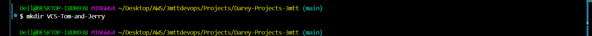
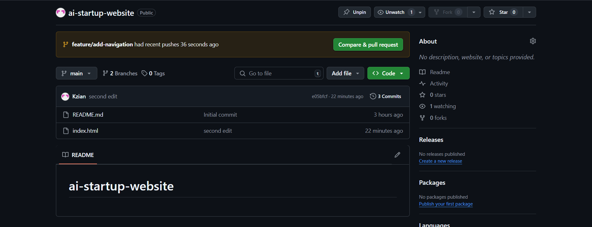

# ai-startup-website
## Version-Control-System (VCS)

In this project, a simulation of how two team members contributed to a project will be shown. Tom, Jerry, and Kzian

### Created branches and contributors

1. `main` - Kzian
2. `feature/update-navigation` - Tom
3. `feature/add-contact-info` - Jerry


## Create a GitHub Repository

1. **Create a New Repository**:
   - On GitHub, click the "+" icon in the top-right corner and select "New repository".
   - Name the repository `ai-startup-website`.
   - Optionally, add a description.
   - Choose "Public" or "Private" visibility.
   - Check the box to "Initialize this repository with a README".
   - Click "Create repository".


---
---

## Clone the Repository

1. **Copy the Repository URL**:
   - On the repository page, click the "Code" button.
   - Copy the HTTPS URL (e.g., `git clone https://github.com/Kzian/ai-startup-website.git`).
    


2. **Clone the Repository Locally**:
   - Open your terminal or command prompt.
   - Create a folder named `git_project` in your desired location:
     ```bash
     mkdir VCS-Tom-and-Jerry
     ```

     

   - Navigate into 'VCS-Tom-and-Jerry' folder 
     ```bash
     cd VCS-Tom-and-Jerry
     ```

 
   - Clone the repository using the copied URL:
     ```bash
     git clone https://github.com/Kzian/ai-startup-website.git
     ```

   - Navigate into the cloned repository


---

## Make Changes and Commit

1. **Create a New File**:
   - Create an empty `index.html` file:
     ```bash
     touch index.html
     ```
   - Add some content to the file using a text editor or IDE.

   

   - Add text into `index.html` file:
    ```html
    <!DOCTYPE html>
    <html lang="en">
    <head>
    <meta charset="UTF-8">
    <meta name="viewport" content="width=device-width, initial-scale=1.0">
    <title>AI Startup</title>
    <link rel="stylesheet" href="styles.css">
    </head>
    <body>
    <header>
        <h1>AI Startup</h1>
    ```


2. **Check Git Status, Stage Changes, Commit changes, and push to Github**:
   - Run the following command to see the changes that have not been staged:
     ```bash
     git status
     git add .
     git commit -m "first commmit"
     git push origin main
     ```
3. Run the git `git status` command again to be sure you are up-to-date


4. **Verify on GitHub**:
   - Go to your repository on GitHub and verify that the `index.html` file has been added.

   

---

# PART 2: Simulating Tom and Jerry's Work

This section shows the steps Tom and Jerry tooks to contribute to the project already created by Kzian.

---

### To begin, Tom and Jerry would create a separate branch each, send out a pull request, and merge with the original branch sotheir changes can be reflected.

### Simulating Jerry's Contribution

#### Steps:
1. **Navigate to the project directory** you just cloned using the command:
   ```bash
   cd ai-startup-website
   ```

2. **Create a new branch called `feature/add-navigation`:**
   ```bash
   git checkout -b feature/add-navigation
   ```
   

   On the left hand pane, navigate to source control, find the folder you are working on, name it, click on the good icon, click commit, and publish branch so as to reflect on github.

   


3. **Verify pull request**: go to github and verify that the pull request went through. After that, compare and pull request, create pull request, and merge pull request.

Tom's compare and pull

Tom's PR

Tom's contribution merged


---

### Simulating Jerry's Contribution

### Steps:
1. **Switch back to the main branch**:
   ```bash
   git checkout main
   ```
   

2. **Create a new branch for Jerry called `add-contact-info`:**; Make the necessary changes to the project (e.g., adding contact information to `index.html`).

   ```bash
   git checkout -b add-contact-info
   ```


On the left hand pane, navigate to source control, find the folder you are working on, name it, click on the good icon, click commit, and publish branch so as to reflect on github.

   

3. **Verify pull request**: go to github and verify that the pull request went through. After that, compare and pull request, create pull request, and merge pull request.

Jerry's compare and pull

Jerry's PR

Jerry's contribution merged


---

### Final verification on github

[Github](https://github.com/Kzian/ai-startup-website/blob/main/index.html)

## Tom and Jerry's updates were successfully merged with the main branch.


